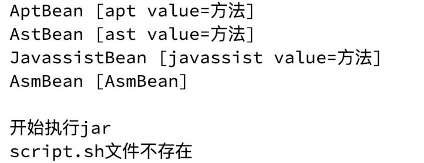
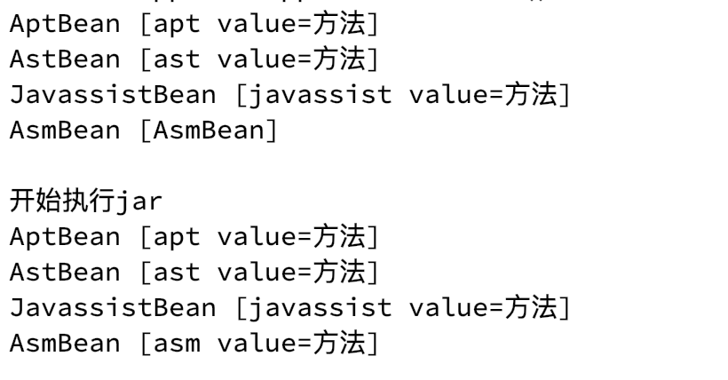

# AOP例子

---

## 1、编译

### 1.设置Project SDK

- <kbd>File</kbd> > <kbd>Project Structure</kbd> > <kbd>Project SDK</kbd> > <kbd>设置'Java JDK'版本</kbd>

### 2.设置Build Tools

- <kbd>Preferences(Settings)</kbd> > <kbd>Build, Execution, Deployment</kbd> > <kbd>Build Tools</kbd> > <kbd>Gradle</kbd> > <kbd>Gradle JVM</kbd> > <kbd>设置'Java JDK'版本</kbd> 

## 2、运行

### 1.正常编译

- <kbd>Build</kbd> > <kbd>Rebuild Project</kbd>

### 2.直接执行

- 直接执行 MainApplication

**执行结果如下**

### 3.验证ASM Plugin

- 先执行 App 模块下的`build`命令
- 然后执行 App 模块下的`asmJar`命令，会在`build/libs`下生成`app.jar`包
- 在此执行 MainApplication

**最终执行结果如下**

## 3、技术

### 1.使用技术

#### 1.AST

AST(Abstract Syntax Tree)抽象语法树，用于在编译过程中修改类。

> 关于 AST 的知识可以参考[《AST for JavaScript developers》](https://github.com/CodeLittlePrince/blog/issues/19)

#### 2.APT

APT(Annotation Processing Tool)注解处理工具，用于在编译过程中生成相关代码。

> 关于 APT 的知识可以参考[《安卓AOP三剑客:APT,AspectJ,Javassist》](https://www.jianshu.com/p/dca3e2c8608a)

#### 3.GradlePlugin

gradle插件，使用 JarTask 重新打包 Jar 包，并且在过程中使用 ASM 修改字节码。

## ∞、三方项目

- [javassist](https://github.com/jboss-javassist/javassist) 字节码工具

- [javapoet](https://github.com/square/javapoet) APT生成.java源文件
- [javaparser](https://github.com/javaparser/javaparser) AST修改.class源文件